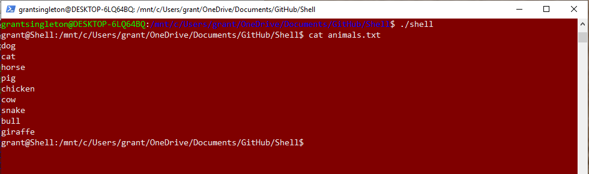

## Description
This is a basic UNIX shell implementation that is running on a Linux sub-system in Windows, written in C++. 

## Tools
* Child Processes (Forking)
* Interprocess Communication (Piping)
* I/O Redirection (Dup2)

## Demonstration 
Here is a demonstration of the shell operating in bashed Powershell. 

### Enter the Shell


I can run ls and view the contents of this folder. 


### Make a directory


### Change Directory


### Make a new file


### Input Redirection


### Piping
I made a small text file called "animals.txt" that I will use to demonstrate piping. 



### Single Pipe


### Double Pipe


### Triple Pipe


## Implemention 

### Display Directory and Process Input

The program loops indefinitely, reads in user input, and processes that input. The following code demonstrates this process in the main function. The current working directory is obtained using the getwd() function, and displayed to the user. The program then waits for the user to input a command and then processes it in the processCommand() function. 

```
while(1) {
  cout << username;
  char buffer[PATH_MAX];
  vector<char> current_path;
  
  getwd(buffer);
  
  int i = 0;
  while(buffer[i] != 0) {
    current_path.push_back(buffer[i]);
    i++
  }
  
  cout << current_path << "$ ";
  
  getline(cin, command);
  processCommand(command);
}
```
### Process Input

In the Process Command function, I declare a stringstream and read the user input delimiting at every pipe operator ('\|'). Each command is then placed in a vector. More than one command in the vector is an indicator that the user is piping.  

```
stringstream command_string(cmd);
string temp_arg;
vector <string> command_vec;

while(getline(command_string, temp_arg, '|')) {
  command_vec.push_back(temp_arg);
  command_string.ignore(1); 
 }
 
 executeCommands(command_vec);

```

### Execute Commands

I support background process calling in my implementation so I need to check if any background processes are complete so that I can acknowledge them, effectively killing their zombie status. The WNOHANG flag is what prevents the program from halting until a child is terminated. This flag is necessary, otherwise this would not be a background process since the program would get stuck here. The function checks to see if there are any children that have terminated, if not, the program moves on. 

```
pid_t pidd = 0;
pid_t result = waitpid(pidd, NULL, WNOHANG);
```

The next lines check if the program needs to pipe (I explain how pipeCommands() works further down the page).

```
if (command_list.size() > 1){
        pipeCommands(command_list);
        return true;
}
```
The program then checks for a series of commands, cd (change directory), &(background process), and </> (input/output redirection). Each of these scenarios are handled differently and each go to their own functions (which I will not describe here). 

### Fork and Execute

Here is how the most basic commands are executed. The program forks and the child process executes the command while the parent waits. Since the parent is waiting for the child, the user will not be able to perform any commands until the process has executed (not the case with background process execution). Also, the reason we don't execute the command in the parent is because we would lose the program since execvp() terminates the program on completion.

```
int pidd = fork();
if (pidd == 0) {
  execvp(arglist[0], arglist);
  cout << "error: no command '" << arglist[0] << "' found" << endl;
  exit(0);
} else {
  wait(&pidd);
}
```

### *Leap Frog* Piping Algorithm 

My solution supports the use of any number of pipes. I used a 'leap frog' algorithm so that no matter how many pipes are needed, only two pipes are ever used. In order to redirect commands to go through the pipe instead of standard input and output (stdin/stdout), I use a Linux system function called dup2.

```
int dup2(int oldfd, int newfd);
```
This function creates a copy of oldfd so that when newfd is used, it is writing to oldfd. Here is an exmple, if I want to redirect the standard output to go to the pipe instead of (in this case) the command line I will call:

```
int fd[2];
pipe(fd);
dup2(fd[1], 1);
```
Now, all standard output will instead go to the pipe. Once a pipe is read from, it no longer contains useful data, so it is repositioned to be collect the input for two commands down the line. Below is my solution for supporting an arbitrary number of pipes (explanation following):

```
pid_t pidd;
int fd[2];  
int fd1[2];
int pipe_num = 0;

for (int i = 0; i < command_list.size(); i++) {
  if (i == command_list.size() - 1) {
            // we don't need another pipe
  } else if (pipe_num == 0) {
      pipe (fd);
      pipe_num = 1;
  } else if (pipe_num == 1) {
      pipe (fd1);
      pipe_num = 0;
  }
  
  pidd = fork();
  if (pidd == 0) {
    if (i != 0 && i != command_list.size() - 1) {
      if (pipe_num) {
          dup2(fd1[0], 0); // input from prev pipe
          dup2(fd[1], 1);  // output to next pipe
      } else {
          dup2(fd[0], 0);  // input from prev pipe
          dup2(fd1[1], 1); // output to next pipe
      }
  } else if (i == 0) {
      if (pipe_num) {
          dup2 (fd[1], 1); 
      } else {   
          dup2(fd1[1], 1); 
      }
  } else {
      if (pipe_num) {   
          dup2 (1, fd[1]); // map output back to stdout
          dup2 (fd[0], 0); 
      } else {
          dup2 (1, fd1[1]);  // map output back to stdout
          dup2 (fd1[0], 0); 
      }
  }

    execvp(arglist[0], arglist);
    // if the command fails, restore and give error
    dup2 (1, fd[1]);
    dup2 (0, fd[0]);
    dup2 (1, fd1[1]);
    dup2 (0, fd1[0]);
    cout << "error: no command '" << arglist[0] << "' found" << endl;
    exit(0);
  } else {
      // restore stdout after each execution 
      dup2 (1, fd[1]);
      dup2 (1, fd1[1]);
      wait(&pidd);
  }
}
```
The algorithm loops through every command, places a pipe between the commands, and executes the command. The pipes alternate each loop. For the first command in the vector, the standard output is redirected to the pipe using dup2, while the standard input remains the same. If the program is somewhere in the middle of the command vector, I redirect the output of the previous pipe to be the input to the current command, and the output of the current command to be the input to the next pipe. Finally, on the last command in the vector, I map the output back to stdout and the final solution will appear in the shell for the user to see. Once the input and output has been mapped, execvp() is called to execute the command. At the end of each loop, I restore stdout/stdin so that the user doesn't lose the command line. 

## Comments

I have not included my full solution or made my repository for this project public since it is a current project at the University and I do not want to aid plaigarism. 
