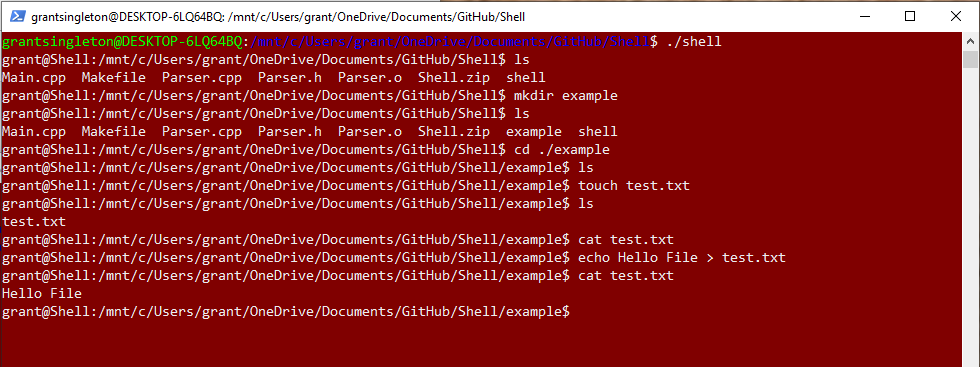

## Welcome to GitHub Pages

You can use the [editor on GitHub](https://github.com/grantsingleton/UNIX-shell/edit/master/index.md) to maintain and preview the content for your website in Markdown files.

Whenever you commit to this repository, GitHub Pages will run [Jekyll](https://jekyllrb.com/) to rebuild the pages in your site, from the content in your Markdown files.

### Markdown

Markdown is a lightweight and easy-to-use syntax for styling your writing. It includes conventions for

```markdown
Syntax highlighted code block

# Header 1
## Header 2
### Header 3

- Bulleted
- List

1. Numbered
2. List

**Bold** and _Italic_ and `Code` text

[Link](url) and 
```

For more details see [GitHub Flavored Markdown](https://guides.github.com/features/mastering-markdown/).

### Jekyll Themes

Your Pages site will use the layout and styles from the Jekyll theme you have selected in your [repository settings](https://github.com/grantsingleton/UNIX-shell/settings). The name of this theme is saved in the Jekyll `_config.yml` configuration file.

### Support or Contact

Having trouble with Pages? Check out our [documentation](https://help.github.com/categories/github-pages-basics/) or [contact support](https://github.com/contact) and we’ll help you sort it out.

## Description
This is a basic UNIX shell implementation that is running on a Linux sub-system in Windows, written in C++. Here is how it works...

### Enter the Shell
Once I run the command. I get the current path of the directory I am in.


I can run ls and view the contents of this folder. 


### Make a directory
I can make a new directory...


### Change Directory
I can change directories. Here I change into the empty directory that I made. 


### Make a File
Make a new file with 'touch' and view it in the directory.


### Input Redirection
Write to the file using 'echo' and input redirection, then read it using 'cat'.



### Piping
I made a small text file called "animals.txt" that I will use to demonstrate piping. 


### Single Pipe


### Double Pipe


### Triple Pipe


## Implemention 
